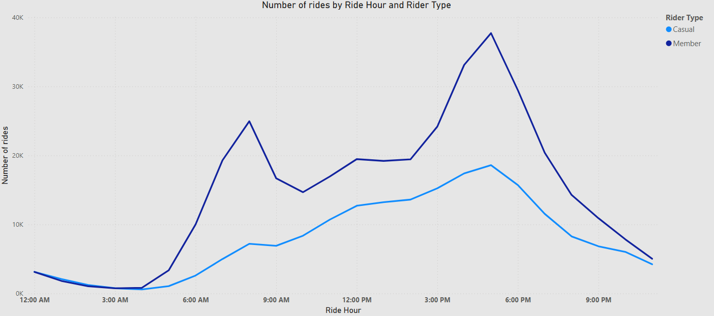

# Context
A company called Divvy is concerned about the usage of its riders. The marketing team has concluded that to increase profit, the company would have to figure out strategies to convert casual riders into members.

### What is a casual rider?
Someone that can purchase a day pass to ride any bike.

### What is a member rider?
Someone with an annual membership and is able to take a bike from any station at any time

### What are the available bike types?
* Classic Bike
* Electric Bike

# Objective
The main objective of this project is to figure out ways for the marketing teams to persuade casual riders into converting to an annual membership.

# Dataset [(Link)](https://divvy-tripdata.s3.amazonaws.com/index.html)
The dataset used in this project covers trip data for the year 2024.

Columns:
* ride_id
* rideable_type (Classic or Electric)
* started_at (Start date and time for the trip)
* ended_at (End date and time for the trip)
* start_station_name
* start_station_id
* end_station_name
* end_station_id
* start_lat
* start_lng
* end_lat
* end_lng
* member_casual (Type of trip rider)

This dataset ROCCCs because it's:
* Reliable
* Original
* Comprehensive
* Current
* Cited

# Data Processing
Python with the `pandas` library is used here because it's fast and easy to use.

The processing stage begins by combining each csv file into one data frame. Then, two new columns are added, `month` and `daytime`. After that, the data is grouped by four categories:
* Rider type (`member_casual` column)
* Ride type
* Ride month
* Ride day time

Then a sample is taken from each group and then merged to form a big sample that is 10% of the original data size.

Now that the data is nicely sampled and merged, it could probably use some cleaning...

First, duplicates are removed based on the `ride_id` column. Then, the following columns are dropped because they are irrelevant to the business problem:
* ride_id
* start_station_name
* start_station_id
* end_station_name
* end_station_id

Also, rows with null values are removed. And finally, data values should be consistent so the only columns that were checked are `rideable_type` and `member_casual` because they contain categorical values.

At the end, the cleaned data is written to a new csv file which will then be imported into a relational database for further analysis using SQL.

# Questions
1. How do annual members and casual riders use Divvy bikes differently?
	* What is the average ride duration for members vs casuals?
	* What is the average ride distance for members vs casuals?
	* What are the most used bike types for members vs casuals?
	* What are the peak times of the day for members vs casuals?
	* What are the peak months of the year for members vs casuals?
2. Why would casual riders buy Divvy annual memberships?
3. How can Divvy use digital media to influence casual riders to become members?

# SQL Analysis
```sql
create table ride (
	member_casual varchar(25),
	rideable_type varchar(25),
	started_at datetime,
	ended_at datetime,
	distance_meters float
);

load data infile "sampled_cleaned.csv"
into table ride
fields terminated by ','
lines terminated by '\n'
ignore 1 rows;

-- What is the average ride duration for members vs casuals?
select
	member_casual,
	round(
		avg(time_to_sec(timediff(ended_at, started_at)) / 60)
	) as avg_ride_dur_mins
from ride
group by member_casual;


-- What is the average ride distance for members vs casuals?
select
	member_casual,
	round(avg(distance_meters)) as avg_ride_distance_meters
from ride
group by member_casual;


-- What are the most used bike types for members vs casuals?
select
	member_casual,
	rideable_type,
	count(*) as rides_num
from ride
group by member_casual, rideable_type
order by member_casual, rides_num desc;


-- What are the peak times of the day for members vs casuals?
select
	member_casual,
	(case
		when hour(started_at) >= 5 and hour(started_at) < 12 then "Morning"
		when hour(started_at) >= 12 and hour(started_at) < 19 then "Afternoon"
		when hour(started_at) >= 19 and hour(started_at) < 23 then "Evening"
		else "Night"
	end) as daytime,
	count(*) as rides_num
from ride
group by member_casual, daytime
order by member_casual, rides_num desc;


-- What are the peak months of the year for members vs casuals?
select
	member_casual,
	monthname(started_at) as month_name,
	count(*) as rides_num
from ride
group by member_casual, month_name
order by member_casual, rides_num desc
```

# Visualizations (Power BI)

### What are the peak times of the day for members vs casuals?
